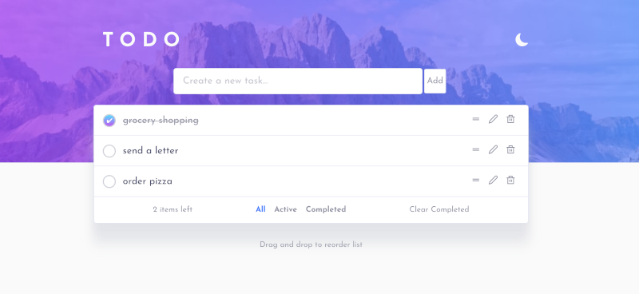
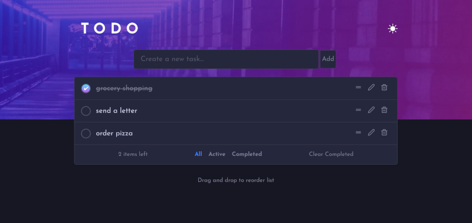
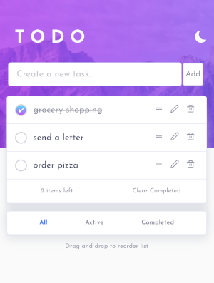
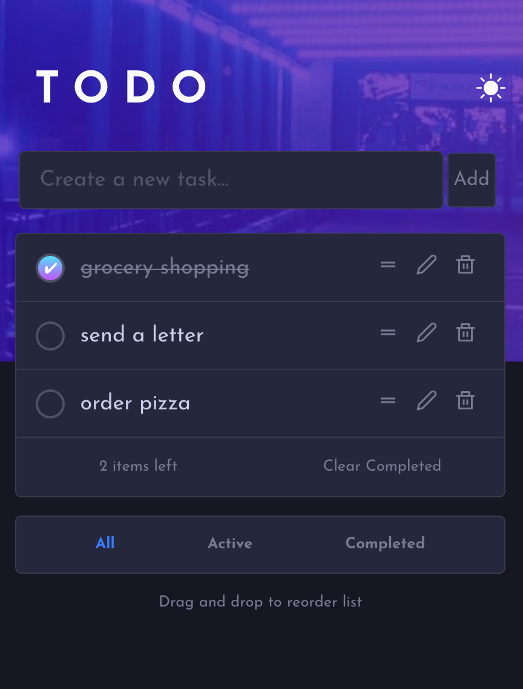

# React todo app with light/dark themes and dnd reordering

This is a solution to the [Todo app challenge on Frontend Mentor](https://www.frontendmentor.io/challenges/todo-app-Su1_KokOW).

## Table of contents

- [Overview](#overview)
  - [The challenge](#the-challenge)
  - [Screenshot](#screenshot)
  - [Links](#links)
- [My process](#my-process)
  - [Built with](#built-with)
  - [What I learned](#what-i-learned)
  - [Continued development](#continued-development)
  - [Useful resources](#useful-resources)
- [Author](#author)

## Overview

### The challenge

Users should be able to:

- View the optimal layout for the app depending on their device's screen size
- See hover states for all interactive elements on the page
- Add new todos to the list
- Mark todos as complete
- Delete todos from the list
- Filter by all/active/complete todos
- Clear all completed todos
- Toggle light and dark mode
- **Bonus**: Drag and drop to reorder items on the list

### Screenshot

- Desktop
  
  

- Mobile
  
  

### Links

- [Solution](https://github.com/risa-r/react-todo-app-with-themes-and-dnd-reordering)
- [Live Site](https://risa-r.github.io/react-todo-app-with-themes-and-dnd-reordering)

## My process

1. I created the todo app without styling first, while making it as accessible as possible by using semantic tags and making buttons and icons screen-reader-friendly.
2. Roughly styled the app as desktop light theme.
3. Since this was my first React app with multiple components to style, I learnt and implemented scoped CSS.
4. I created dark/light theme using custom CSS, which I also learnt for the first time.
5. I fixed bugs of functions (mainly on buttons) and polished the details of the style.
6. Spent quite a lot of time lerning how to add drag-and-drop function. I initially tried React-dnd, but it didn't work so I used dnd-kit instead.
7. Made it responsive.

### Built with

- Semantic HTML5 markup
- CSS custom properties
- Flexbox
- CSS Grid
- Desktop-first workflow
- [React](https://reactjs.org/) - JS library
- [React scoped CSS](https://github.com/gaoxiaoliangz/react-scoped-css)
- [React Icons](https://react-icons.github.io/react-icons/)
- [dnd-kit](https://dndkit.com/)

### What I learned

- How to use React Icons and how to style them

- Maing buttons and icons screen-reader-friendly by inclusively hiding descriptive (but visually uneccessary) texts

```js
<button onClick={() => setIsEditing(true)} ref={editButtonRef}>
  <FiEdit2 className="edit-delete-btn" />
  <span className="visually-hidden">Edit task</span>
</button>
```

```css
.visually-hidden {
  position: absolute !important;
  clip: rect(0 0 0 0);
  clip-path: inset(50%);
  height: 1px;
  width: 1px;
  overflow: hidden;
  white-space: nowrap;
}
```

- Styling multiple components with React scoped CSS

- Adding multiple themes using custom CSS

```js
export default function App({ tasks }) {
  const [theme, setTheme] = useLocalStorage(
    "theme",
    defaultDark ? "dark" : "light"
  );
  return ...
}
```

```css
:root {
  --background-color: hsl(0, 0%, 98%);
  --background-image: url(../images/bg-desktop-light.jpg);
  --background-mobile-image: url(../images/bg-mobile-light.jpg);
  ...;
}

[data-theme="dark"] {
  --background-color: hsl(235, 21%, 11%);
  --background-image: url(../images/bg-desktop-dark.jpg);
  --background-mobile-image: url(../images/bg-mobile-dark.jpg);
  ...;
}
```

- add dnd reordering feature with dnd-kit

### Continued development

For the future React projects I'd love to use:

- React scoped CSS
- custom CSS for multiple themes
- dnd-kit for drag-and-drop features

I also want to work out things I couldn't figure out this time:

- correctly use useRef to control focusing to improve accessibility (hopefully without using useEffect)
- drag-and-drop feature without compromising visual design (currently drag handle disappears while dragging)
- how to use DragOverlay of dnd-kit
- how to use React-dnd

### Useful resources

- [CSS-Tricks "Easy Dark Mode (and Multiple Color Themes!) in React" by Abram Thau](https://css-tricks.com/easy-dark-mode-and-multiple-color-themes-in-react/) - This helped me to create the dark/light theme for the first time! I did not imagine making multiple themes can be this simple. I would love to use this approach for my future projects.

- [CSS-Tricks "A Complete Guide to Custom Properties" by Chris Coyier](https://css-tricks.com/a-complete-guide-to-custom-properties/) - To use the above approach for the themes, I learnt custom CSS for the first time from this article.

- [Cannot install with npm #42](https://github.com/gaoxiaoliangz/react-scoped-css/issues/42) - I struggled with installing react-scoped-css and this page gave us the solution.

- [CSS-Tricks "Make a smooth shadow, friend"](https://css-tricks.com/make-a-smooth-shadow-friend/) - Normal drop shadow did not look right on this app but the example on this article helped me to make a natural-looking (at least as much as I can make for now) shadow.

## Author

- Frontend Mentor - [@risa-r](https://www.frontendmentor.io/profile/risa-r)
